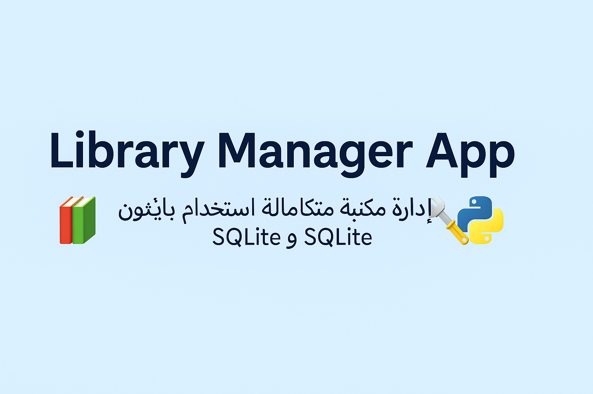

  

# 🇸🇦 الشرح باللغة العربية

📚 Library Manager App
Library Manager هو برنامج متكامل لإدارة مكتبة كتب باستخدام Python و SQLite.
يتيح هذا التطبيق إضافة، تعديل، حذف، استعارة، وإرجاع الكتب بالإضافة إلى تسجيل الدخول للمستخدمين.

✨ مميزات التطبيق
✅ إنشاء حساب مستخدم (Sign Up) وتسجيل دخول (Sign In)

✅ استعادة كلمة المرور عند نسيانها (Forget Password)

✅ عرض جميع الكتب المتوفرة بالمكتبة

✅ إضافة كتاب جديد إلى المكتبة

✅ تعديل بيانات الكتب الحالية

✅ حذف كتاب من المكتبة

✅ استعارة كتاب وربطه بالمستخدم الذي استعاره

✅ إرجاع كتاب إلى المكتبة

✅ عرض جميع الكتب المُعارة حاليًا

✅ البحث عن كتاب عبر اسمه

✅ حماية التعامل مع قاعدة البيانات (commit, rollback, close)

🛠️ التقنيات المستخدمة
1- لغة البرمجة: Python 3
2- قاعدة البيانات: SQLite3
3- نمط البرمجة: البرمجة الكائنية التوجه (OOP)

🚀 طريقة تشغيل المشروع
1- تأكد من وجود Python مثبت على جهازك.
2- افتح المشروع عبر محرر الأكواد أو التيرمنال.
3- شغل الملف الرئيسي: python main.py

📂 بنية قاعدة البيانات
| الجدول          | الأعمدة                           |
| :-------------- | :-------------------------------- |
| users           | user_id, name, email, password    |
| books           | id, title, author, year, borrowed |
| borrowed_books  | id, user_id, book_id              |

📌 ملاحظات إضافية
1- يتم حفظ التغييرات تلقائيًا عند كل عملية.
2- التحقق من صحة البيانات قبل الإضافة أو التعديل.
3- حماية من الأخطاء الشائعة أثناء التعامل مع قاعدة البيانات.
4- استقبال رسائل توضيحية عند نجاح أو فشل أي عملية.

🧠 اقتراحات للتطوير المستقبلي
1- إضافة تسجيل دخول عبر البريد الإلكتروني مع التحقق.
2- دعم إرسال تنبيهات عند تأخير إرجاع الكتب.
3- تطوير نسخة بواجهة رسومية GUI باستخدام Tkinter أو PyQt.
4- دعم الإعارة بالتاريخ والزمن والمدة.

🏆 تم بحمد الله

# 🇬🇧 English Version

📚 Library Manager App
Library Manager is a fully functional application for managing a book library using Python and SQLite.
This program allows users to add, edit, delete, borrow, and return books, with user authentication.

✨ Features
✅ Create an account (Sign Up) and Login (Sign In)
✅ Recover password if forgotten (Forget Password)
✅ View all available books in the library
✅ Add a new book to the library
✅ Edit existing book details
✅ Delete a book from the library
✅ Borrow a book and link it to the borrowing user
✅ Return a borrowed book to the library
✅ View all currently borrowed books
✅ Search for a book by its title
✅ Secure database operations (commit, rollback, close)

🛠️ Technologies Used
1- Programming Language: Python 3
2- Database: SQLite3
3- Programming Paradigm: Object-Oriented Programming (OOP)

🚀 How to Run the Project
1- Make sure you have Python installed on your machine.
2- Open the project in your code editor or terminal.
3- Run the main file: python main.py
4- Follow the on-screen instructions inside the application.

📂 Database Structure
| Table           | Columns                           |
| :-------------- | :-------------------------------- |
| users           | user_id, name, email, password    |
| books           | id, title, author, year, borrowed |
| borrowed_books  | id, user_id, book_id              |

📌 Additional Notes
1- All changes are automatically saved after each operation.
2- Data validation is applied before adding or editing entries.
3- Prevents common database errors during operations.
4- User-friendly messages for successful and failed operations.

🧠 Future Enhancements
1- Add email-based login and verification
2- Implement notification system for late book returns
3- Develop a graphical interface (GUI) using Tkinter or PyQt
4- Support borrowing books with return dates and time limits

🏆 Project Completed Successfully